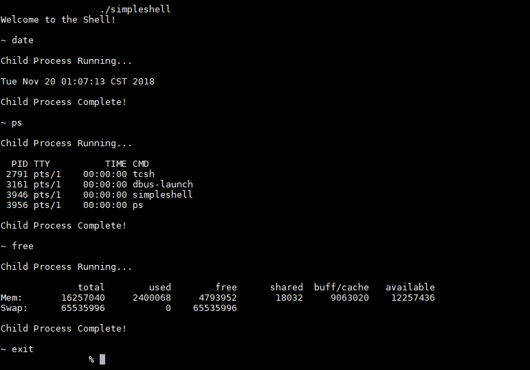

# Simple Linux Shell
This is a simple Linux/Unix shell that allows for commands with arguments to be executed.
This was written for learning the basics of shell programming.

## Functionality of the shell

This shell contains three shell built-in commands:

environment - The shell will print a list of the environment variables and values.  
path - The shell will print the value of the PATH environment variable.  
exit - The shell will exit with status 0.  

If a user enters a command, the shell will fork into a subprocess.  
The shell will wait for the command to complete and then exit the subprocess.  

## How to run the shell

This shell will only work on a Linux/Unix system.  
First, you must compile the shell by typing " gcc -o shelltest shell_lab_djs ".  
Then you can simply run the shell by typing " ./shelltest ".  

## Example of the running shell

Here is an example of the shell executing the commands: date, ps, and free.  

The shell first prints "Welcome to the Shell!".  
Once a command is entered, it prints "Child Process Running..." to indicate the forked process.  
After the command is completed, the shell prints "Child Process Complete" to indicate a successfull execution.  
When finished, the "exit" built-in command can be entered which causes the shell to exit with status 0.  
